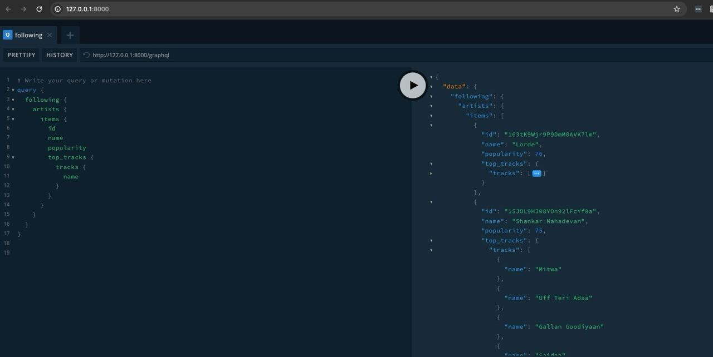

A demo for tailcall using the Spotify API; to get details of artists followed by a user on Spotify.




## Installation

### NPM

```bash
npm i -g @tailcallhq/tailcall
```

### Yarn

```bash
yarn global add @tailcallhq/tailcall
```

### Usage

```bash
tailcall start ./schema.graphql
```
Following query queries `following` and `top_tracks` at the same time:
```graphql
query {
  following {
    artists {
      items {
        id
        name
        popularity
        top_tracks {
          tracks {
            name
          }
        }
      }
    }
  }
}
```

The same is also available as a REST API:
```bash
/api/following
```
